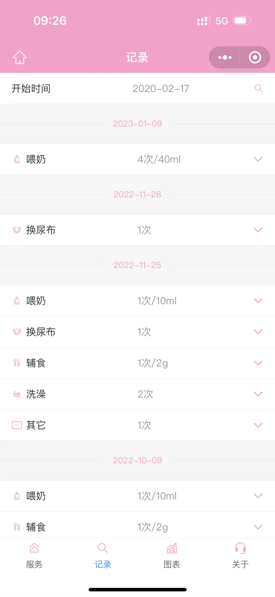

# 宝宝速记-线上版本

#### 介绍
婴儿日常行为记录，比如喂奶，辅食，便便，睡觉等

#### 软件架构

1. 本项目采用小程序的云开发，代码只是给出了业务代码，导入IDE后并不能直接运行

2. 采用vant weapp 地址:https://youzan.github.io/vant-weapp/#/intro

3.本仓库比之前开源的项目多了图表和图片广场的功能，调整了部分颜色。

#### 安装教程

1.  下载代码
2.  自己先创建个云开发项目
3.  把相关的代码页面拷贝到刚才自己创建的小程序项目下的

#### 使用说明
截图如下：

扫码体验：

 代码写的比较辣鸡 :joy: 大佬们凑合着看吧，！
有任何疑问都可以留言，为看到后会第一时间回复～感谢支持～😄
